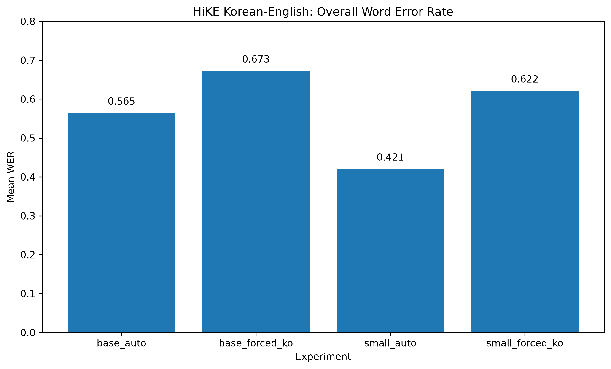
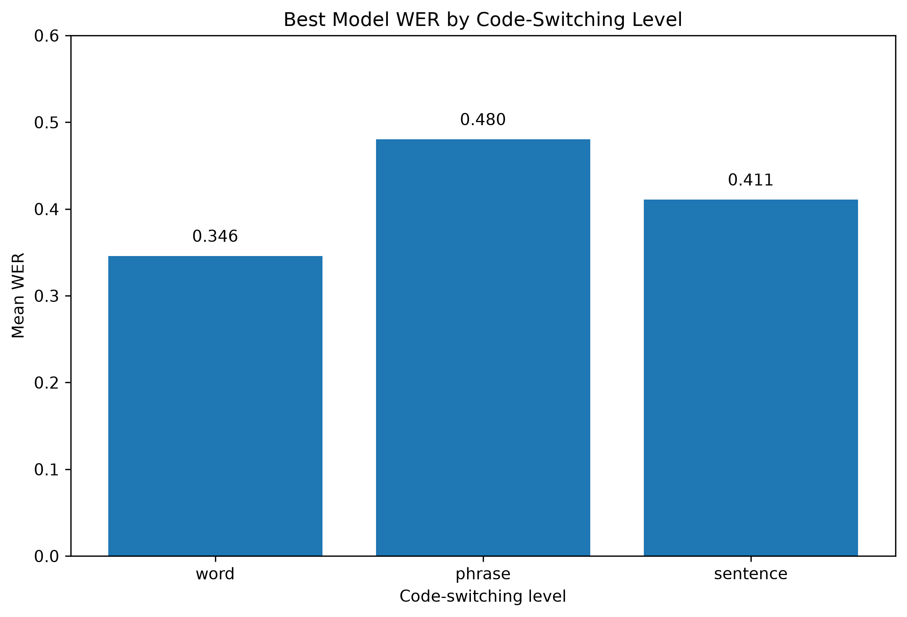
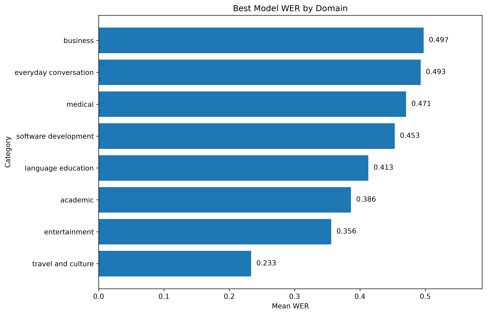
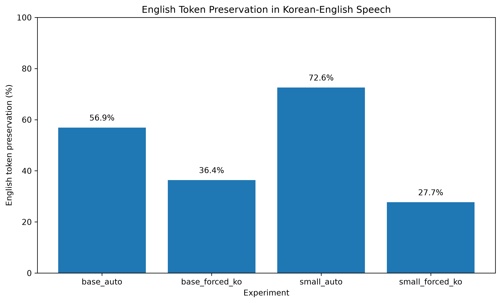
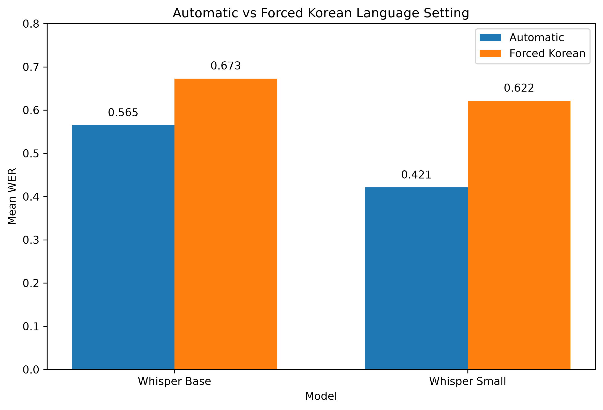

# AccentBench

Measuring accent, language-identification, and code-switching robustness in Whisper ASR.

AccentBench is a small, reproducible study investigating how automatic speech recognition systems behave under accented, multilingual, and code-switched speech.

The project began from a practical observation while developing an AI-enabled Hospital Information Management System in Pakistan with an autonomous voice-booking agent: speech recognition appeared to degrade for accented and code-switched speech. AccentBench turns that observation into measurable experiments.

## Research Paper

The full paper describing AccentBench's methodology, experiments, results, error analysis, and limitations is available here: [Read the paper](docs/AccentBench_Paper.pdf) ([source](docs/AccentBench_Paper.md))

## Research Questions

The benchmark currently evaluates:

* **Accent robustness** — How does Whisper perform across different English accent groups?
* **Language identification** — How often does Whisper incorrectly identify accented English as another language?
* **Code-switching** — How well does Whisper transcribe speech containing multiple languages within the same utterance?
* **Language conditioning** — Does explicitly specifying the expected language improve transcription accuracy?

## Why This Matters

Speech recognition errors are not always caused by poor acoustic transcription alone. In multilingual settings, an ASR system may incorrectly identify the spoken language, convert words from one language into another script, or behave differently when the expected language is explicitly specified.

AccentBench separates these failure modes instead of relying only on overall Word Error Rate (WER). This makes it possible to examine not only whether Whisper makes an error, but also what kind of error occurs and under which linguistic conditions.

## Key Findings

### Whisper performs substantially better with its larger small model

Across the HiKE Korean-English benchmark, Whisper-small with automatic language detection achieved the lowest WER:

| Configuration                 | Mean WER | Median WER |
| ----------------------------- | -------: | ---------: |
| Whisper-small + automatic     |   0.4209 |     0.3333 |
| Whisper-base + automatic      |   0.5648 |     0.5714 |
| Whisper-small + forced Korean |   0.6216 |     0.6250 |
| Whisper-base + forced Korean  |   0.6729 |     0.6340 |

Under automatic language detection, moving from Whisper-base to Whisper-small reduced mean WER by approximately 25.5%.

### Automatic language detection outperformed forced Korean on the HiKE benchmark

For Whisper-small:

**0.4209 → 0.6216 WER**

when moving from automatic detection to forced Korean.

For Whisper-base:

**0.5648 → 0.6729 WER**

This corresponds to a relative WER reduction of approximately 32.3% for Whisper-small and 16.1% for Whisper-base when automatic detection is used instead of forcing Korean.

This result is specific to the evaluated Korean-English code-switched dataset. It should not be interpreted as evidence that automatic language detection is universally better than language forcing for Korean ASR.

### Code-switching level affects transcription difficulty

Under the best configuration, Whisper-small with automatic language detection:

| Code-switching level | Mean WER |
| -------------------- | -------: |
| Word                 |   0.3458 |
| Sentence             |   0.4107 |
| Phrase               |   0.4802 |

Phrase-level code-switching was the most difficult category in this evaluation.

### English token preservation is substantially better with automatic detection

The benchmark also measures whether English words embedded in Korean speech remain recognizable as English tokens rather than being converted into Korean phonetic spellings.

| Configuration                 | English token preservation |
| ----------------------------- | -------------------------: |
| Whisper-small + automatic     |                      72.6% |
| Whisper-base + automatic      |                      56.9% |
| Whisper-base + forced Korean  |                      36.4% |
| Whisper-small + forced Korean |                      27.7% |

This provides a complementary view of code-switching robustness that ordinary WER alone does not capture.

## Track 1 — Accent Robustness

### Accent-driven Word Error Rate

AccentBench evaluated 600 utterances, with 100 samples from each of six accent groups in the DTU54DL/common-accent dataset.

| Accent              | WER (Whisper-base) | WER (Whisper-small) |
| ------------------- | -----------------: | ------------------: |
| German (non-native) |              0.169 |               0.130 |
| Hong Kong English   |              0.194 |               0.178 |
| Southern African    |              0.211 |               0.192 |
| Filipino            |              0.224 |               0.188 |
| South Asian         |              0.252 |               0.187 |
| Singaporean English |              0.410 |               0.410 |

Scaling from Whisper-base to Whisper-small improved WER for every evaluated accent group except Singaporean English, where performance remained essentially flat.

The South Asian category combines Indian, Pakistani, and Sri Lankan English. It therefore should not be interpreted as a Pakistani-English-only result.

### Language Misidentification

A subset of accented-English clips triggered a more severe failure: Whisper produced output consistent with a non-English decoding decision rather than an ordinary transcription error. This is inferred from output characteristics (non-Latin script, or a small set of Malay/Indonesian markers), not from Whisper's internal language-identification decision directly, so the rate below is a heuristic proxy rather than a ground-truth label.

| Accent              | Whisper-base | Whisper-small |
| ------------------- | -----------: | ------------: |
| Singaporean English |        14.3% |         13.1% |
| Filipino            |         1.0% |          1.0% |
| South Asian         |         1.0% |          0.0% |
| German              |         0.0% |          0.0% |
| Hong Kong English   |         0.0% |          1.0% |
| Southern African    |         0.0% |          1.0% |

Singaporean English's rate is far higher than every other group under both model sizes, and does not meaningfully improve with the larger model.

### Forced-English Recovery

For the 14 Singaporean clips that triggered the language-misidentification heuristic, forcing English reduced mean WER from:

**1.091 → 0.242**

This represents a **77.8% relative reduction** in WER.

Two of the 14 clips went from complete failure to perfect transcription.

This suggests that at least some of these failures originate in language selection rather than an inability to transcribe the accent itself.

## Track 2 — Hindi-English Code-Switching

AccentBench also evaluates Hindi-English code-switched speech using the MUCS 2021 dataset.

A suitable public Urdu-English speech corpus was not identified for the initial benchmark, so Hindi-English was used as a linguistically related proxy for the Urdu-English use case.

Hindi and Urdu are closely related at the spoken-language level, but they are not interchangeable.

The original code-switching experiment evaluated:

| Model         | Mean WER | Median WER |
| ------------- | -------: | ---------: |
| Whisper-base  |    1.150 |      1.000 |
| Whisper-small |    1.058 |      0.804 |

These results indicate that code-switched speech can be substantially more difficult than the individual accent groups evaluated in Track 1.

### Transliteration Pattern

A recurring failure mode was the phonetic rendering of embedded English terms into the script associated with the other language.

For example, English technical terms could be rendered as approximate Devanagari transliterations rather than preserved in Latin script.

This distinction matters because a transcription can remain partially understandable while still failing to preserve the language boundary or written form of a code-switched utterance.

A separate hallucination pattern was also observed, where generated content was not supported by the source audio.

Because the transliteration and hallucination measurements rely partly on heuristic analysis, these should be treated as exploratory error-analysis results rather than definitive population estimates.

## Track 3 — HiKE Korean-English Code-Switching

The latest AccentBench experiment evaluates Korean-English code-switched speech using 100 clips from the HiKE benchmark.

Four conditions were evaluated:

* Whisper-base + automatic language detection
* Whisper-base + forced Korean
* Whisper-small + automatic language detection
* Whisper-small + forced Korean

All 100 clips successfully completed all four conditions, producing 400 transcription results.

### Overall Results

| Experiment      | Model | Language mode | Mean WER | Median WER |
| --------------- | ----- | ------------- | -------: | ---------: |
| small_auto      | small | automatic     |   0.4209 |     0.3333 |
| base_auto       | base  | automatic     |   0.5648 |     0.5714 |
| small_forced_ko | small | forced Korean |   0.6216 |     0.6250 |
| base_forced_ko  | base  | forced Korean |   0.6729 |     0.6340 |

Whisper-small with automatic language detection was the best-performing configuration.

### Code-Switching Level

For the best configuration:

| Level    | Clips | Mean WER |
| -------- | ----: | -------: |
| Word     |    41 |   0.3458 |
| Sentence |     6 |   0.4107 |
| Phrase   |    53 |   0.4802 |

Phrase-level switching produced the highest WER.

The sentence-level result should be interpreted cautiously because only six clips were available.

### Domain Performance

Under Whisper-small + automatic language detection:

| Domain                | Mean WER |
| --------------------- | -------: |
| Travel and culture    |   0.2335 |
| Entertainment         |   0.3562 |
| Academic              |   0.3862 |
| Language education    |   0.4128 |
| Software development  |   0.4533 |
| Medical               |   0.4707 |
| Everyday conversation |   0.4929 |
| Business              |   0.4975 |

Travel and culture produced the lowest WER, while business and everyday-conversation samples were among the more difficult categories.

These values describe this benchmark's sampled domains and should not be interpreted as general domain rankings for Korean ASR.

### English Token Preservation

English-token preservation provides another perspective on code-switching robustness.

| Experiment      | English token preservation |
| --------------- | -------------------------: |
| small_auto      |                      72.6% |
| base_auto       |                      56.9% |
| base_forced_ko  |                      36.4% |
| small_forced_ko |                      27.7% |

The strong reduction under forced Korean is consistent with the qualitative errors observed in the transcriptions: English terms are frequently rendered using Korean phonetic approximations or replaced entirely.

#### Example

Reference:

```text
pull request 올리기 전에 test case 한 번 더 체크해 봐.
```

Observed output:

```text
풀 리켓을 올리기 전에 테스트 케이스 한 번 더 체크해봐
```

The output preserves the general content but converts English terms into Korean-script phonetic representations.

This illustrates why WER and language-specific token preservation capture different aspects of code-switching robustness.

## Track 4 — Language Conditioning: Urdu vs Korean

The fourth track investigates whether explicitly specifying the expected language improves Whisper transcription accuracy.

Two Whisper model sizes were evaluated under:

* **Automatic** — Whisper determines the language.
* **Forced** — the expected language is explicitly supplied.

### Urdu

The final Urdu comparison contains 80 matched clips for which all four conditions produced valid WER values.

| Model         | Automatic WER | Forced Urdu WER | Relative improvement |
| ------------- | ------------: | --------------: | -------------------: |
| Whisper-base  |        0.6855 |          0.5821 |                15.1% |
| Whisper-small |        0.8473 |          0.3984 |                53.0% |

Forcing Urdu substantially improved performance, particularly for Whisper-small.

### Korean

The earlier Korean language-conditioning evaluation used 100 clips from the Zeroth Korean test set, sampled across 10 speakers.

| Model         | Automatic WER | Forced Korean WER | Relative improvement |
| ------------- | ------------: | ----------------: | -------------------: |
| Whisper-base  |        0.4737 |            0.4726 |                0.23% |
| Whisper-small |        0.3791 |            0.3791 |                0.00% |

Whisper automatically identified Korean on all 100 clips.

For Whisper-small, automatic and forced decoding produced identical predictions on all 100 clips.

### Cross-Language Finding

The contrast between Urdu and the earlier Korean evaluation demonstrates that language conditioning does not have a universal effect.

| Language | Base improvement | Small improvement |
| -------- | ---------------: | ----------------: |
| Urdu     |            15.1% |             53.0% |
| Korean   |            0.23% |             0.00% |

However, the two evaluations involve different datasets and speech conditions, so this comparison should be treated as evidence of a dataset- and language-dependent effect, not as a controlled causal comparison between Urdu and Korean.

## Figures

The latest HiKE analysis produces five figures.

**Overall WER**



**WER by Code-Switching Level**



**WER by Domain**



**English Token Preservation**



**Automatic vs Forced Korean**



## Dashboard

An interactive Streamlit dashboard presents the original AccentBench evaluation tracks with charts, raw-data tables, and an upload-your-own-clip demonstration.

Run locally with:

```bash
streamlit run src/dashboard.py
```

## Methodology

### Models

* OpenAI Whisper base
* OpenAI Whisper small
* Inference performed locally using the `openai-whisper` Python package
* Experiments were performed using CPU inference

### Accent Data

The accent evaluation uses DTU54DL/common-accent.

* 6 accent groups
* 100 samples per group
* 600 utterances total

### Hindi-English Code-Switching Data

The code-switching evaluation uses the MUCS 2021 Hindi-English dataset.

* 100 sampled utterances
* Fixed sampling seed for reproducibility
* Hindi-English used as a proxy for the Urdu-English use case

### Korean-English Code-Switching Data

The HiKE experiment evaluates:

* 100 clips
* 4 experimental conditions
* 400 total transcriptions
* Whisper-base and Whisper-small
* Automatic and forced Korean language settings

### Language-Conditioning Data

The Urdu experiment uses 80 matched clips across all four conditions, sampled from the UrduSpeech US-benchmark set, a published 156-hour Urdu speech corpus. This resource was identified after the Hindi-English proxy evaluation (Track 2) had already been built.

The earlier Korean language-conditioning experiment uses 100 Zeroth Korean clips sampled across 10 speakers.

### Metric

Word Error Rate (WER) was calculated using `jiwer`.

Lower WER indicates better transcription accuracy.

For language-conditioning experiments:

```text
Relative improvement =

(Automatic WER - Forced WER)

----------------------------- × 100

Automatic WER
```

## Reproducibility

### Install Dependencies

```bash
pip install -r requirements.txt
```

### Run the Accent Benchmark

```bash
python src/explore_data.py
python src/run_inference.py
python src/analyze_errors.py
```

### Run the Dashboard

```bash
streamlit run src/dashboard.py
```

### Run the Language-Conditioning Analysis

```bash
python src/final_analysis.py
```

### Run the HiKE Korean-English Benchmark

See the corresponding scripts in `src/` for dataset preparation, inference, analysis, and figure generation.

### Generate the HiKE Figures

```bash
python src/make_hike_figures.py
```

Generated figures are written to:

```text
results/hike_analysis/figures/
```

## Limitations

AccentBench is intentionally small and exploratory. The results should not be interpreted as definitive measurements of Whisper's global multilingual robustness.

Important limitations include:

* Sample sizes are relatively small.
* The South Asian accent category combines Indian, Pakistani, and Sri Lankan English.
* No suitable public Urdu-English code-switching corpus was identified for the initial benchmark, so Hindi-English was used as a proxy.
* The transliteration analysis relies partly on heuristic methods.
* The language-misidentification rate is a heuristic proxy (non-Latin script and a small set of Malay/Indonesian markers), not Whisper's internal language-identification output observed directly.
* The HiKE Korean-English experiment contains only 100 clips.
* The sentence-level HiKE analysis contains only six samples.
* The Korean language-conditioning and HiKE experiments use different datasets and should not be treated as a controlled comparison.
* Only Whisper-base and Whisper-small were evaluated. Larger Whisper models may behave differently.
* Experiments were performed using CPU-only inference.
* WER alone does not capture every aspect of multilingual or code-switched transcription quality.
* Speaker independence within the accent track (Track 1) is not established, since speaker identifiers were not retained in the released metadata.

## Future Work

Potential extensions include:

* Identify or construct a dedicated Urdu-English code-switching corpus to replace the Hindi-English proxy used in Track 2. (UrduSpeech is now used for Track 4's language-conditioning evaluation, but does not cover code-switched speech.)
* Supplement Urdu-English evaluation with a carefully documented self-recorded dataset.
* Evaluate Whisper-medium and Whisper-large.
* Add additional Korean-English and Urdu-English speakers.
* Investigate why automatic language detection is particularly beneficial for the HiKE code-switched benchmark.
* Investigate the relationship between language-identification errors and transcription errors.
* Improve the English-token preservation metric.
* Add controlled accent and dialect categories.
* Evaluate additional multilingual ASR systems.
* Compare Whisper against newer multilingual ASR models.
* Add confidence calibration and language-identification accuracy as separate evaluation metrics.

## Project Structure

```text
AccentBench/
│
├── data/                         # datasets (not committed)
│
├── docs/
│   ├── AccentBench_Paper.md
│   ├── AccentBench_Paper.pdf
│   ├── methodology.md
│   └── findings_limitations.md
│
├── src/
│   ├── explore_data.py
│   ├── run_inference.py
│   ├── analyze_errors.py
│   ├── analyze_errors_small.py
│   ├── forced_language_test.py
│   ├── load_code_switch_data.py
│   ├── run_inference_codeswitch.py
│   ├── run_inference_codeswitch_small.py
│   ├── tally_codeswitch_patterns.py
│   ├── dashboard.py
│   │
│   ├── final_analysis.py
│   ├── forced_urdu_test.py
│   ├── inspect_korean.py
│   ├── korean_base_auto.py
│   ├── prepare_korean.py
│   ├── run_remaining_korean.py
│   ├── run_urdu_base.py
│   ├── run_urdu_base_forced.py
│   ├── run_urdu_benchmark.py
│   ├── run_urdu_small_matched.py
│   ├── test_urdu.py
│   ├── analyze_hike_results.py
│   ├── make_hike_figures.py
│   └── ...
│
├── results/
│   ├── final/
│   ├── plots/
│   └── hike_analysis/
│       ├── figures/
│       ├── overall_wer.csv
│       ├── wer_by_category.csv
│       ├── wer_by_cs_level.csv
│       ├── english_token_preservation.csv
│       ├── auto_vs_forced.csv
│       ├── best_examples.csv
│       └── worst_examples.csv
│
├── screenshots/
│
├── requirements.txt
├── .gitignore
└── README.md
```

## License

This project uses datasets and resources subject to their respective licenses.

The Zeroth Korean dataset is available under CC BY 4.0.

The UrduSpeech corpus is subject to its own license terms; review these independently before redistributing any downloaded UrduSpeech data.

Dataset licenses should be reviewed independently before redistribution of any downloaded dataset files.
