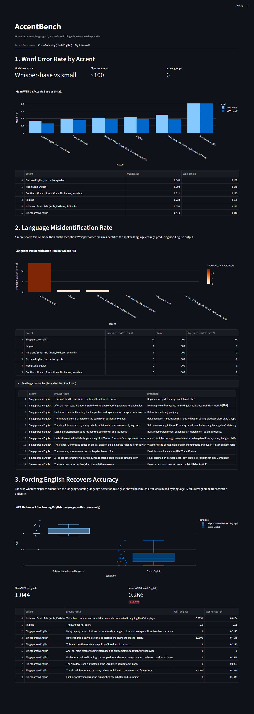
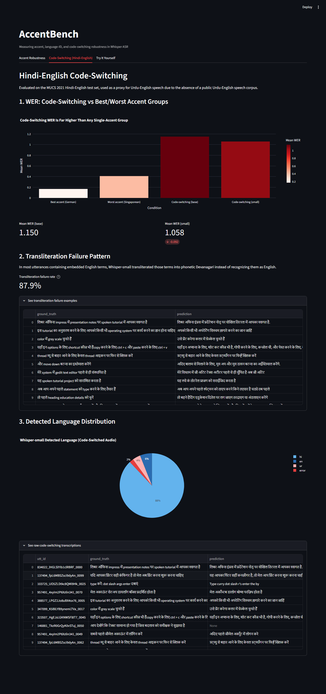
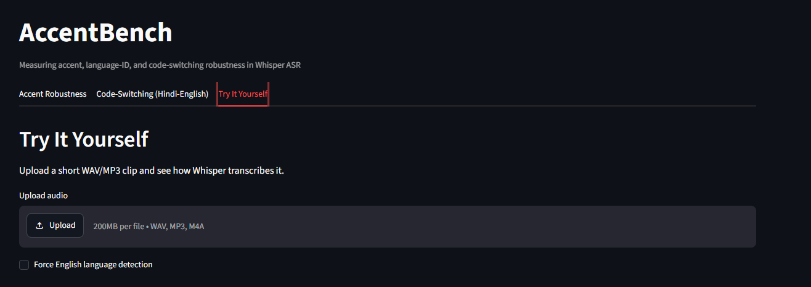

# AccentBench

**Measuring accent, language-identification, and code-switching robustness in OpenAI's Whisper ASR model.**

## Motivation

While co-developing an AI-Enabled Hospital Information Management System (deployed at two hospitals in Pakistan) featuring an autonomous voice-booking agent, I noticed the underlying speech recognition pipeline seemed to degrade noticeably for accented and code-switched speech — a pattern that never got formally measured, just anecdotally observed while debugging.

AccentBench is a small, reproducible study built to actually measure that observation: how does a widely-used ASR model (Whisper) perform across different English accents, and how does it handle Hindi-English code-switching — a linguistic pattern closely related to the Urdu-English speech my FYP's voice agent needed to handle?

## Summary of Findings

This project surfaces three distinct robustness failure modes, at increasing levels of severity:

## Key Takeaways

- Whisper is generally robust across common English accents, with WER improving further as model size increases
- Singaporean English exposes a persistent language-identification failure that is largely corrected by forcing English decoding
- Hindi-English code-switching remains substantially harder than accented English, even for the larger model
- Most code-switch errors arise from script conversion and phonetic transliteration of English terms, not complete hallucination

### 1. Accent-driven Word Error Rate (WER) varies moderately

Evaluated on 600 utterances (100 per accent group) from the [DTU54DL/common-accent](https://huggingface.co/datasets/DTU54DL/common-accent) dataset:

| Accent | WER (Whisper-base) | WER (Whisper-small) |
|---|---|---|
| German (non-native) | 0.169 | 0.130 |
| Hong Kong English | 0.194 | 0.178 |
| Southern African | 0.211 | 0.192 |
| Filipino | 0.224 | 0.188 |
| South Asian (India/Pakistan/Sri Lanka) | 0.252 | 0.187 |
| Singaporean English | 0.410 | 0.410 |

Scaling from Whisper-base to Whisper-small improved WER for every accent group **except Singaporean English**, which stayed essentially flat. This suggests that the errors observed for Singaporean English are not fully explained by model capacity alone.

*Note: the "South Asian" label bundles Indian, Pakistani, and Sri Lankan English together — the dataset does not provide a clean Pakistani-only subset, so this measures South Asian English robustness broadly, not Pakistani English specifically.*

### 2. Language misidentification is a distinct, severe failure mode

Beyond ordinary mis-transcription, a subset of clips triggered a more severe failure: Whisper misidentified the spoken language entirely, producing non-English output (Malay/Indonesian-looking text, and in one case Japanese script) for English audio.

| Accent | Language misidentification rate |
|---|---|
| Singaporean English | 13.1–13.3% |
| Filipino | 1.0% |
| South Asian | 0–1.0% |
| German, Hong Kong, Southern African | 0% |

This rate held constant across both Whisper-base and Whisper-small — confirming it isn't fixed by scaling model size.

**Forcing English detection recovers most of the lost accuracy.** For the 14 Singaporean clips that triggered language misidentification, forcing `language="en"` dropped mean WER from **1.044 → 0.266** — a 75% relative improvement, with 2 of 14 clips going from complete failure to perfect transcription. This shows the failure originates in language *detection*, not a fundamental inability to transcribe the accent.

### 3. Code-switching is a harder, qualitatively different problem

Using the [MUCS 2021](https://www.openslr.org/104/) Hindi-English code-switched speech dataset (I did not identify a suitable publicly available Urdu-English code-switched speech corpus for this study, so Hindi-English was used as a linguistically related proxy — Hindi and Urdu are closely related at the spoken level):

| | WER (Whisper-base) | WER (Whisper-small) |
|---|---|---|
| Mean | 1.150 | 1.058 |
| Median | 1.000 | 0.804 |

Even the larger model performs far worse here than on any single-accent English group — code-switching is not simply "another hard accent."

Manual and automated inspection of Whisper-small's outputs revealed a specific pattern: **in ~88% of utterances containing embedded English technical terms** (e.g. "impress," "operating system," "shortcut," "ctrl"), those terms were typically rendered as approximate phonetic Devanagari spellings rather than preserved in their original Latin script (e.g., "operating system" → "अपरेटिंग सिस्चम"). A separate hallucination pattern (generated content absent from the source audio) appeared in roughly 8% of utterances.

This suggests Whisper can often follow the semantic content of code-switched speech, but struggles to detect *where* the language boundary falls within a single sentence — a finer-grained version of the whole-utterance language misidentification seen in Track 2.

## Dashboard

An interactive Streamlit dashboard presents all three tracks with live charts, expandable raw-data tables, and a live upload-your-own-clip demo.

**Accent Robustness tab** — WER by accent (base vs small), language misidentification rate, and the forced-English recovery comparison:



**Code-Switching tab** — WER comparison against best/worst accent groups, the transliteration failure rate, and detected-language distribution:



**Try It Yourself tab** — upload any WAV/MP3 clip and see Whisper's live transcription, with an option to force English detection:



Run it locally with `streamlit run src/dashboard.py` (see setup instructions below).

## Methodology

- **Model:** OpenAI Whisper (`base` and `small`), run locally via the `openai-whisper` Python package
- **Accent data:** [DTU54DL/common-accent](https://huggingface.co/datasets/DTU54DL/common-accent), 100 samples per accent group across 6 groups (600 total)
- **Code-switching data:** [MUCS 2021 Hindi-English test set](https://www.openslr.org/104/), 100 randomly sampled utterances (fixed seed for before/after comparability)
- **Metric:** Word Error Rate (WER) via `jiwer`, plus a custom heuristic for detecting non-English/language-misidentified output
- **Environment:** Windows, Python 3.12, CPU-only inference

## Limitations

- Sample sizes (n≈100 per group) are small for statistical rigor; results should be read as indicative, not definitive
- The "South Asian" accent label bundles multiple countries and cannot isolate Pakistani English specifically
- No suitable public Urdu-English speech corpus was identified for this study; Hindi-English is used as a linguistically-related proxy, not a substitute
- The transliteration-failure heuristic (Track 3) is word-overlap based and may over/under-count edge cases; verified against a manual spot-check but not independently validated at scale
- Only Whisper-base and Whisper-small were tested; larger models (medium, large) may behave differently

## Project Structure

```
accent-bench/
├── data/                              # datasets (not committed — see download instructions below)
├── src/
│   ├── explore_data.py                # sample accent dataset
│   ├── run_inference.py               # Whisper-base accent evaluation
│   ├── analyze_errors.py              # language-misidentification detection (base)
│   ├── analyze_errors_small.py        # language-misidentification detection (small)
│   ├── forced_language_test.py        # forced-English recovery test
│   ├── load_code_switch_data.py       # parse MUCS Kaldi-format data
│   ├── run_inference_codeswitch.py    # Whisper-base code-switch evaluation
│   ├── run_inference_codeswitch_small.py  # Whisper-small code-switch evaluation
│   ├── tally_codeswitch_patterns.py   # transliteration/hallucination detection
│   └── dashboard.py                   # Streamlit dashboard (3 tabs)
├── results/                           # output CSVs
├── screenshots/                       # dashboard screenshots for this README
└── requirements.txt
```

## Running it yourself

```bash
pip install -r requirements.txt
python src/explore_data.py            # build accent sample
python src/run_inference.py           # run Whisper on accents
python src/analyze_errors.py          # detect language-switch failures
streamlit run src/dashboard.py        # view results
```

Dataset downloads:
- Accent data loads automatically via Hugging Face `datasets`
- Code-switching data: download `Hindi-English_test.tar.gz` from [openslr.org/104](https://www.openslr.org/104/) and extract to `data/mucs_hindi_english/`

## Future Work

- Extend to Urdu-English code-switching once/if a public speech corpus becomes available, or supplement with a small self-recorded sample
- Test larger Whisper models (medium, large) to see if the code-switching gap narrows further
- Investigate targeted fine-tuning on the Singaporean English language-misidentification failure specifically