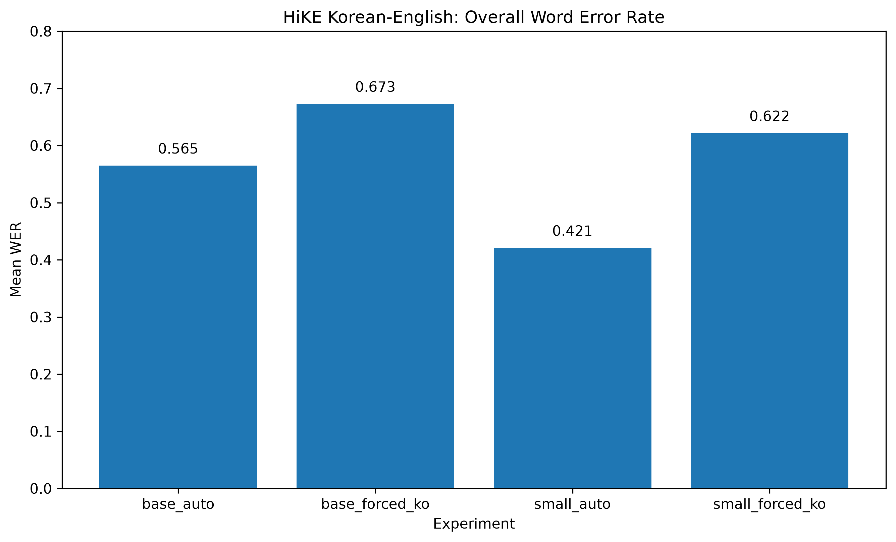
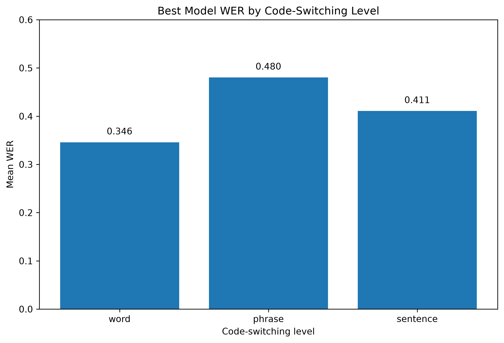
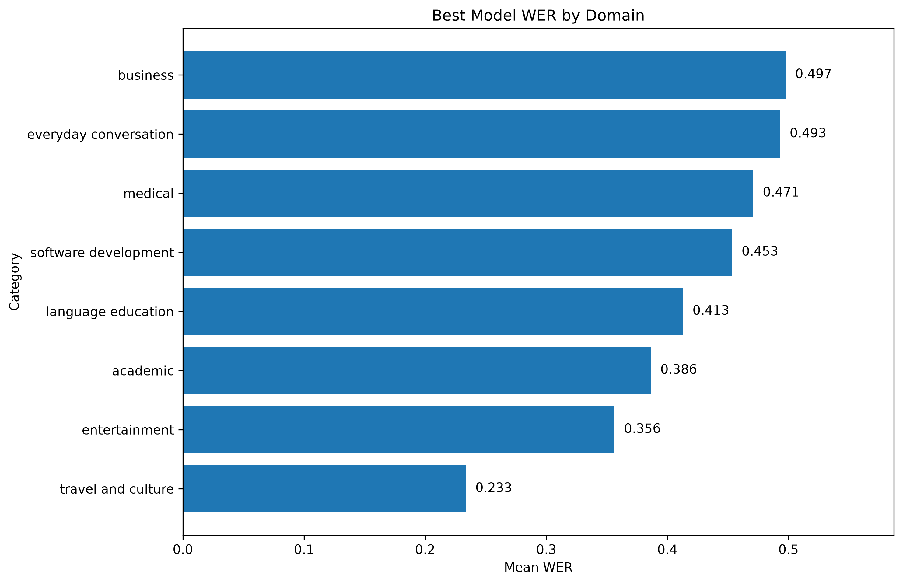
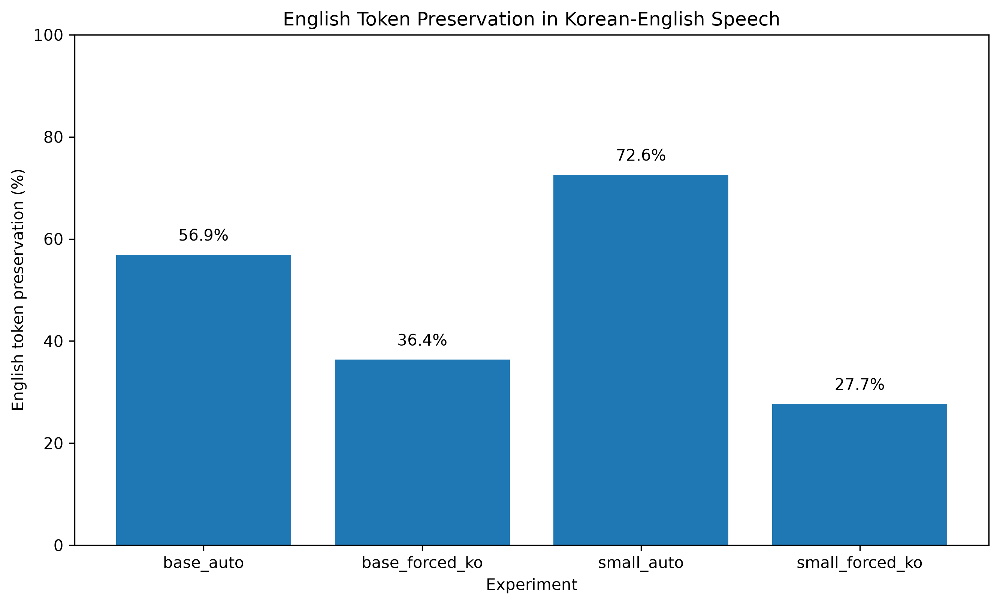
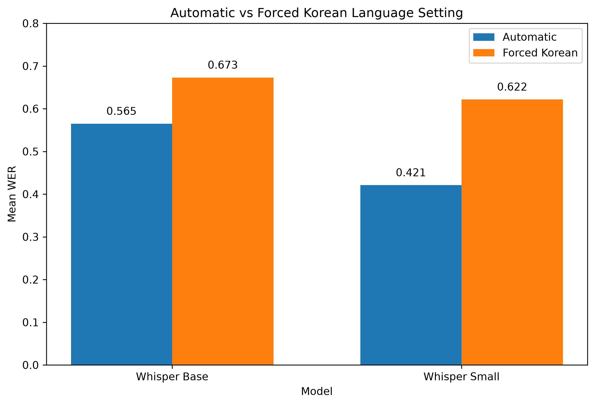

# AccentBench

Measuring accent, language-identification, and code-switching robustness in Whisper ASR.

AccentBench is a small, exploratory study investigating how automatic speech recognition (ASR) systems behave under accented, multilingual, and code-switched speech.

The project began from a practical observation while developing an AI-enabled Hospital Information Management System in Pakistan with an autonomous voice-booking agent: speech recognition appeared to degrade for accented and code-switched speech. AccentBench turns that observation into measurable experiments.

## Research Paper

The full paper describing AccentBench's methodology, experiments, results, error analysis, statistical analysis, and limitations is available here:

* [Read the paper](docs/AccentBench_Paper.pdf)
* [Paper source](docs/AccentBench_Paper.md)

## Research Questions

AccentBench currently evaluates four related failure modes:

* **Accent robustness** — How does Whisper perform across different English accent groups?
* **Language identification** — How often do accented-English clips trigger output patterns consistent with a non-English decoding decision?
* **Code-switching** — How well does Whisper transcribe speech containing multiple languages within the same utterance?
* **Language conditioning** — Does explicitly specifying the expected language improve transcription accuracy?

## Why This Matters

Speech recognition errors are not always caused by ordinary acoustic transcription difficulty. In multilingual settings, an ASR system may select an unexpected language, render words from one language in another script, or behave differently when the expected language is explicitly specified.

AccentBench therefore examines several failure modes rather than relying only on aggregate Word Error Rate (WER). This makes it possible to investigate not only whether Whisper makes an error, but also what kind of error occurs and under which linguistic conditions.

---

# Key Findings

## Whisper-small outperformed Whisper-base on the HiKE Korean-English benchmark

Across the evaluated HiKE Korean-English sample, Whisper-small with automatic language detection achieved the lowest mean WER among the four evaluated configurations.

| Configuration                 | Mean WER | Median WER |
| ----------------------------- | -------: | ---------: |
| Whisper-small + automatic     |   0.4209 |     0.3333 |
| Whisper-base + automatic      |   0.5648 |     0.5714 |
| Whisper-small + forced Korean |   0.6216 |     0.6250 |
| Whisper-base + forced Korean  |   0.6729 |     0.6340 |

Under automatic language detection, moving from Whisper-base to Whisper-small reduced mean WER by approximately **25.5% relative to the Whisper-base result**.

This comparison is specific to the evaluated HiKE sample and does not establish that model size will produce the same improvement on other datasets.

## Automatic language detection outperformed forced Korean on the HiKE benchmark

For Whisper-small, moving from automatic language detection to forced Korean increased mean WER:

**0.4209 → 0.6216**

This is a **47.7% relative increase in WER**, using the automatic-detection WER as the denominator.

For Whisper-base:

**0.5648 → 0.6729**

This is a **19.1% relative increase in WER**, using the same denominator.

Equivalently, automatic detection reduced WER relative to forced Korean by approximately **32.3% for Whisper-small** and **16.1% for Whisper-base**, when the forced-Korean WER is used as the denominator. These are the same difference expressed against different baselines.

For Whisper-small, the paired per-clip difference was **+0.2007 WER**, with a 95% bootstrap CI of **[0.1294, 0.2736]** based on 100 matched clips.

The result is specific to the evaluated Korean-English code-switched dataset. It should not be interpreted as evidence that automatic language detection is universally better than language forcing for Korean ASR.

## Code-switching level differed in the sampled HiKE evaluation

Under Whisper-small with automatic language detection:

| Code-switching level | Clips | Mean WER |
| -------------------- | ----: | -------: |
| Word                 |    41 |   0.3458 |
| Sentence             |     6 |   0.4107 |
| Phrase               |    53 |   0.4802 |

Phrase-level switching had the highest mean WER in this sampled evaluation.

The categories describe the annotations available in the evaluated HiKE sample and should not be interpreted as a general ranking of code-switching difficulty. In particular, the sentence-level result is based on only six clips, and 23 of the 53 phrase-level clips carry more than one switching label in the HiKE metadata.

## English-token preservation was higher with automatic detection

The HiKE analysis also measures whether English words embedded in Korean speech remain recognizable as English tokens rather than being converted into Korean-script phonetic representations.

| Configuration                 | English token preservation |
| ----------------------------- | -------------------------: |
| Whisper-small + automatic     |                      72.6% |
| Whisper-base + automatic      |                      56.9% |
| Whisper-base + forced Korean  |                      36.4% |
| Whisper-small + forced Korean |                      27.7% |

This provides a complementary diagnostic to WER. A reference English token counts as preserved if its letters appear, case-insensitively, anywhere in the hypothesis; rates are pooled over 715 reference English tokens in 91 clips. The metric measures preservation of English tokens in the transcription, is lenient for very short tokens, and is not a full measure of positional or semantic correctness. A stricter whole-word match gives the same ordering of the four conditions.

---

# Track 1 — Accent Robustness

## Accent-driven Word Error Rate

AccentBench sampled **600 utterances**, with 100 samples from each of six accent groups in the DTU54DL/common-accent dataset.

After excluding invalid or missing predictions from the corresponding WER calculations, **591 Whisper-base** and **589 Whisper-small** predictions contributed valid WER values.

| Accent              | WER (Whisper-base) | WER (Whisper-small) |
| ------------------- | -----------------: | ------------------: |
| German (non-native) |              0.169 |               0.130 |
| Hong Kong English   |              0.194 |               0.178 |
| Southern African    |              0.211 |               0.192 |
| Filipino            |              0.224 |               0.188 |
| South Asian         |              0.252 |               0.187 |
| Singaporean English |              0.410 |               0.410 |

Whisper-small had lower WER than Whisper-base for every evaluated accent group except Singaporean English, where the mean WER remained essentially unchanged.

The South Asian category combines Indian, Pakistani, and Sri Lankan English. It therefore should **not** be interpreted as a Pakistani-English-only result.

## Language-Identification Failure Proxy

A subset of accented-English clips triggered a more severe failure: Whisper produced output characteristics consistent with a non-English decoding decision rather than an ordinary transcription error.

The analysis does **not** directly observe Whisper's internal language-identification probability or language-classification decision. Instead, it uses output characteristics — primarily non-Latin script and a small set of Malay/Indonesian lexical markers — as a heuristic proxy.

| Accent              | Whisper-base | Whisper-small |
| ------------------- | -----------: | ------------: |
| Singaporean English |        14.3% |         13.1% |
| Filipino            |         1.0% |          1.0% |
| South Asian         |         1.0% |          0.0% |
| German              |         0.0% |          0.0% |
| Hong Kong English   |         0.0% |          1.0% |
| Southern African    |         0.0% |          1.0% |

Singaporean English had the highest heuristic rate in both model conditions: **14.3% for Whisper-base and 13.1% for Whisper-small**, compared with 0–1% for the other evaluated groups. The flagged clips are not the same set under the two models (only 5 clips are flagged under both), so similar rates should not be read as the same clips failing under both.

The heuristic should therefore be interpreted as an **output-based language-selection failure proxy**, not as a direct measurement of Whisper's internal language identification.

## Forced-English Recovery

Fourteen Singaporean-English clips triggered the language-selection heuristic in the analysis.

For these 14 clips, forcing English reduced mean WER from:

**1.091 → 0.242**

This represents a **77.8% relative reduction in mean WER**.

The paired per-clip reduction was **0.8489 WER**, with a 95% bootstrap CI of **[0.7524, 0.9430]**.

All 14 clips improved under forced English, and two moved from a WER at or above 1.0 to a perfect transcription.

This result is consistent with a substantial language-selection component to the observed errors in these flagged clips. It does not establish that language selection explains all of the Singaporean-English performance gap, because the remaining unflagged clips also showed elevated WER: excluding the 14 flagged clips, the Whisper-base mean for Singaporean English is 0.297, and replacing each flagged clip's WER with its forced-English WER gives about 0.289, still above the 0.169–0.252 range of the other groups.

Because the language-misidentification measure is heuristic and Whisper's internal language decision was not recorded, the experiment demonstrates recoverability under forced English rather than directly identifying the model's internal failure mechanism.

---

# Track 2 — Hindi-English Code-Switching

AccentBench also evaluates Hindi-English code-switched speech using the MUCS 2021 dataset.

A suitable public Urdu-English speech corpus was not identified for the initial benchmark, so Hindi-English was used as a linguistically related **proxy** for the Urdu-English use case.

Hindi and Urdu are closely related at the spoken-language level, but they are not interchangeable. Track 2 is **not** genuine Urdu-English code-switching, and results from this track should not be presented as direct evidence about Urdu-English ASR. The dedicated Urdu data in Track 4 tests language conditioning, not code-switching, so it does not replace this track; genuine Urdu-English code-switching remains incompletely evaluated.

The original code-switching evaluation sampled 100 utterances. After excluding invalid or missing predictions, **99 Whisper-base** and **98 Whisper-small** predictions contributed valid WER values.

| Model         | Valid clips | Mean WER | Median WER |
| ------------- | ----------: | -------: | ---------: |
| Whisper-base  |          99 |    1.150 |      1.000 |
| Whisper-small |          98 |    1.058 |      0.804 |

For the paired comparison, **97 utterances had valid WER values for both Whisper-base and Whisper-small**.

The paired mean difference, calculated as **Base WER − Small WER**, was **0.0821 WER**, with a 95% bootstrap CI of **[-0.0270, 0.1771]**.

Because the confidence interval includes zero, the paired bootstrap does not clearly distinguish the observed mean WER difference from zero.

The observed WERs were higher than those of the accent groups in Track 1, although the datasets, speech conditions, and evaluation tasks differ and therefore do not constitute a controlled comparison.

## Transliteration Pattern

A recurring error pattern was the rendering of embedded English terms into the script associated with the other language.

For example, English technical terms could be represented by approximate Devanagari transliterations rather than preserved in Latin script.

This distinction matters because a transcription can remain partially understandable while still failing to preserve the language boundary or written form of a code-switched utterance.

As a rough exploratory indication for Whisper-small, 58 of the 66 evaluable utterances whose reference contains English words had no reference English word reproduced in Latin script in the prediction (52 of the 58 contained no Latin text at all, and 56 contained Devanagari). This is **not** a validated transliteration failure rate: it treats a single matching Latin word as success and does not verify that missing words were transliterated rather than dropped or garbled.

A separate exploratory analysis also identified some unusually long generated outputs relative to their references. These were treated as a heuristic hallucination signal rather than as definitive hallucination labels.

The transliteration and hallucination analyses rely partly on heuristic procedures and should therefore be treated as exploratory error analysis rather than definitive population estimates.

---

# Track 3 — HiKE Korean-English Code-Switching

The latest AccentBench experiment evaluates Korean-English code-switched speech using **100 clips from the HiKE benchmark**.

Four conditions were evaluated:

* Whisper-base + automatic language detection
* Whisper-base + forced Korean
* Whisper-small + automatic language detection
* Whisper-small + forced Korean

All 100 clips successfully completed all four conditions, producing **400 transcription results**.

## Overall Results

| Experiment      | Model | Language mode | Mean WER | Median WER |
| --------------- | ----- | ------------- | -------: | ---------: |
| small_auto      | small | automatic     |   0.4209 |     0.3333 |
| base_auto       | base  | automatic     |   0.5648 |     0.5714 |
| small_forced_ko | small | forced Korean |   0.6216 |     0.6250 |
| base_forced_ko  | base  | forced Korean |   0.6729 |     0.6340 |

Whisper-small with automatic language detection had the lowest mean WER among the four evaluated conditions.

## Code-Switching Level

For Whisper-small with automatic language detection:

| Level    | Clips | Mean WER |
| -------- | ----: | -------: |
| Word     |    41 |   0.3458 |
| Sentence |     6 |   0.4107 |
| Phrase   |    53 |   0.4802 |

Phrase-level switching had the highest mean WER in this sample.

The sentence-level result should be interpreted cautiously because only six clips were available.

## Domain Performance

Under Whisper-small with automatic language detection:

| Domain                | Mean WER |
| --------------------- | -------: |
| Travel and culture    |   0.2335 |
| Entertainment         |   0.3562 |
| Academic              |   0.3862 |
| Language education    |   0.4128 |
| Software development  |   0.4533 |
| Medical               |   0.4707 |
| Everyday conversation |   0.4929 |
| Business              |   0.4975 |

Travel and culture produced the lowest WER in the sampled data, while business and everyday-conversation samples were among the higher-WER categories.

These values describe the evaluated sample (7–16 clips per domain) and should **not** be interpreted as general domain rankings for Korean ASR.

## English Token Preservation

English-token preservation provides another perspective on code-switching robustness.

| Experiment      | English token preservation |
| --------------- | -------------------------: |
| small_auto      |                      72.6% |
| base_auto       |                      56.9% |
| base_forced_ko  |                      36.4% |
| small_forced_ko |                      27.7% |

The lower preservation rates under forced Korean are consistent with qualitative errors in which English terms are rendered using Korean-script phonetic approximations or replaced.

The preservation metric is a script/token-preservation diagnostic. It does not establish that every preserved token is correctly aligned or semantically correct.

### Example

Reference:

```text
pull request 올리기 전에 test case 한 번 더 체크해 봐.
```

Observed output (Whisper-base; the output was the same under automatic and forced Korean):

```text
풀 리켓을 올리기 전에 테스트 케이스 한 번 더 체크해봐
```

The output preserves much of the general content but converts the English terms "pull request" and "test case" into Korean-script phonetic representations. (The reference's word for "check" is already written in Korean script.)

Because this clip is converted under both language modes, it illustrates the kind of error rather than the difference between automatic and forced decoding. It shows why WER and language-specific token preservation capture different aspects of code-switching robustness.

## Language-Selection Analysis

A further analysis of the HiKE results found that the effect of forced Korean was concentrated largely in clips where Whisper-small's automatic decoding selected English.

Under automatic decoding, Whisper-small labelled **70 clips as Korean, 29 as English, and 1 as Portuguese**.

| Automatic label | Clips | Mean WER (automatic) | Mean WER (forced Korean) |
| --------------- | ----: | -------------------: | -----------------------: |
| Korean          |    70 |               0.4913 |                   0.5078 |
| English         |    29 |               0.2196 |                   0.8603 |
| Portuguese      |     1 |               1.3333 |                   1.6667 |

On the 29 English-labelled clips, forcing Korean was worse on 27, and these clips account for 0.1858 of the 0.2007 mean paired difference. On the 70 Korean-labelled clips, WER was exactly equal on 67 and the predicted text was identical on 65.

This provides a possible explanation for the overall HiKE result: forcing Korean can interfere with clips whose code-switched content leads the model to treat English as an important language component.

This interpretation is a hypothesis, not a tested mechanism. It shows where the difference occurs, not why, and the automatic language label is a model output rather than ground truth. It is specific to the evaluated sample and decoding conditions.

---

# Track 4 — Language Conditioning

The fourth track investigates whether explicitly specifying the expected language changes Whisper transcription accuracy.

Two Whisper model sizes were evaluated under:

* **Automatic** — Whisper determines the language during decoding.
* **Forced** — the expected language is explicitly supplied.

The Urdu and Korean experiments use different datasets and should therefore be interpreted as separate language-conditioning evaluations rather than as a controlled cross-language experiment.

## Urdu

The final Urdu comparison contains **80 matched clips** (from 100 randomly sampled Standard Urdu clips) for which all four model/conditioning combinations produced valid WER values.

| Model         | Automatic WER | Forced Urdu WER | Relative improvement |
| ------------- | ------------: | --------------: | -------------------: |
| Whisper-base  |        0.6855 |          0.5821 |                15.1% |
| Whisper-small |        0.8473 |          0.3984 |                53.0% |

Forcing Urdu produced a larger improvement for Whisper-small than for Whisper-base.

For Whisper-base, the paired automatic-minus-forced WER difference was **0.1034**, with a 95% bootstrap CI of **[0.0366, 0.1663]**.

For Whisper-small, the paired automatic-minus-forced WER difference was **0.4489**, with a 95% bootstrap CI of **[0.3653, 0.5361]**.

For Whisper-small, automatic decoding selected Hindi on **54 of the 80 matched clips**. All 54 of those outputs used Devanagari script.

On the 25 clips where Whisper-small selected Urdu, the automatic and forced predictions were identical.

These results suggest that the benefit of forcing Urdu in this evaluation was concentrated in clips where automatic decoding selected a different language.

Whisper-base behaved differently: it labelled 43 of the 80 clips as Hindi but wrote most of those outputs in Urdu script (26 of 43), so the label alone does not determine the output script.

The detected-language label is a model output and should not be interpreted as an independently verified ground-truth language classification. A Devanagari output scored against an Urdu-script reference also gets a WER near 1 from the script mismatch alone, so this pattern is not evidence about acoustic recognition quality.

### Reproducibility note

The Urdu automatic-decoding run was not completely deterministic. Because Whisper decoding can involve temperature fallback and the original inference did not set a random seed, rerunning the Whisper-small automatic condition produced some differing predictions: on the 92 clips with a valid WER in both runs, 8 predictions differed. The mean WER over the 80 matched clips was approximately 0.824 in the original run and 0.8473 in the rerun used in the paper.

The reported results therefore correspond to the documented evaluation run rather than implying exact bit-for-bit reproducibility across every future environment.

The 80 matched Urdu clips come from 23 speakers, with one speaker contributing 29 of them, so the clip-level bootstrap confidence intervals should not be interpreted as fully speaker-independent estimates.

## Korean

The earlier Korean language-conditioning evaluation used **100 clips from the Zeroth Korean test set**, sampled across **10 speakers**.

This dataset is distinct from the HiKE Korean-English benchmark used in Track 3.

| Model         | Automatic WER | Forced Korean WER | Relative improvement |
| ------------- | ------------: | ----------------: | -------------------: |
| Whisper-base  |        0.4737 |            0.4726 |                0.23% |
| Whisper-small |        0.3791 |            0.3791 |                0.00% |

Whisper automatically identified Korean on all 100 clips.

For Whisper-small, automatic and forced decoding produced identical predictions on all 100 clips.

For Whisper-base, 99 of the 100 predictions were identical between the two conditions; the small aggregate difference was driven by the remaining clip.

For Whisper-small, the paired automatic-minus-forced difference was exactly **0.0000**, with a degenerate 95% bootstrap interval of **[0.0000, 0.0000]**, because every paired prediction was identical.

## Cross-Language Finding

The Urdu and earlier Korean language-conditioning evaluations illustrate that explicit language conditioning can have different effects under different datasets and speech conditions.

| Language | Base improvement | Small improvement |
| -------- | ---------------: | ----------------: |
| Urdu     |            15.1% |             53.0% |
| Korean   |            0.23% |             0.00% |

However, these are **not controlled cross-language comparisons**. The datasets, speakers, linguistic conditions, and recording characteristics differ.

The results should therefore be interpreted as evidence that the effect of language conditioning is **dataset- and language-dependent**, rather than as a causal comparison between Urdu and Korean.

---

# Figures

The latest HiKE analysis produces five figures.

### Overall WER



### WER by Code-Switching Level



### WER by Domain



### English Token Preservation



### Automatic vs Forced Korean



---

# Dashboard

An interactive Streamlit dashboard presents the original AccentBench evaluation tracks with charts, raw-data tables, error-analysis views, and an upload-your-own-clip demonstration.

Run locally with:

```bash
streamlit run src/dashboard.py
```

---

# Methodology

## Models

AccentBench evaluates two OpenAI Whisper model sizes:

* Whisper-base
* Whisper-small

Inference was performed locally using the `openai-whisper` Python package.

The experiments were conducted using CPU inference.

## Accent Data

The accent evaluation uses the DTU54DL/common-accent dataset.

* 6 accent groups
* 100 sampled utterances per group
* 600 sampled utterances total
* 591 valid Whisper-base WER observations
* 589 valid Whisper-small WER observations

The South Asian category combines Indian, Pakistani, and Sri Lankan English.

## Hindi-English Code-Switching Data

The code-switching evaluation uses the MUCS 2021 Hindi-English dataset.

* 100 sampled utterances
* 99 valid Whisper-base WER observations
* 98 valid Whisper-small WER observations
* 97 matched clips for the paired Base-versus-Small comparison
* Fixed sampling seed used for benchmark sampling
* Hindi-English used as a proxy for the Urdu-English use case

The proxy choice reflects the lack of a suitable public Urdu-English speech corpus identified during the initial benchmark. Hindi-English results should not be interpreted as direct Urdu-English measurements.

## HiKE Korean-English Data

The HiKE experiment uses 100 sampled clips from the Korean-English benchmark.

* 100 clips, sampled with `pandas.Series.sample(n=100, random_state=42)` from the 1,121-clip test split
* 4 experimental conditions
* 400 total transcriptions
* Whisper-base and Whisper-small
* Automatic language detection and forced Korean

The evaluated HiKE sample contains different code-switching levels and domains. These categories are descriptive properties of the sampled benchmark rather than controlled experimental factors.

The exact HiKE dataset revision used for the original local benchmark was not recorded, limiting exact dataset-version reproducibility.

## Language-Conditioning Data

### Urdu

The final Urdu analysis uses 80 matched clips for which all four model/conditioning combinations produced valid WER values. The 80 clips are a subset of 100 Standard Urdu clips randomly sampled (seed 42) from the UrduSpeech benchmark by `src/run_urdu_benchmark.py`.

### Korean

The earlier Korean language-conditioning experiment uses 100 Zeroth Korean clips sampled across 10 speakers (10 per speaker, seed 42).

This is a separate dataset from the HiKE Korean-English experiment.

## WER

Word Error Rate measures the minimum number of word-level substitutions, insertions, and deletions required to transform the reference transcription into the model prediction, normalized by the number of reference words.

Lower WER indicates fewer word-level transcription errors.

The implementation differs across parts of the benchmark:

* **Track 1** (and its forced-English re-run) uses `jiwer` after lowercasing both reference and prediction.
* **Track 2** and the **Urdu** part of Track 4 use `jiwer` with no case or punctuation normalization.
* **Track 3 (HiKE)** and the **Korean (Zeroth)** part of Track 4 use a whitespace-token Levenshtein implementation in the inference scripts, again with no normalization. On the HiKE predictions it reproduced `jiwer` values to floating-point precision.

WER values should therefore be interpreted together with the preprocessing and analysis procedure used for each track, and absolute values should not be compared across tracks as if they were measured identically.

## Text Normalization

The main WER calculations use the normalization implemented by the corresponding inference scripts.

For the original accent evaluation (Track 1), reference and prediction text are lowercased before JiWER calculation. Punctuation and numerals are otherwise retained. The MUCS, Urdu, HiKE, and Zeroth Korean evaluations apply no case or punctuation normalization.

Because spacing, punctuation, and numerals are not normalized, absolute WER is sensitive to orthography, particularly for Korean and Urdu. The benchmark does not claim that its WER normalization is optimal for every language or script.

## Relative Improvement

For the language-conditioning tables, relative improvement is calculated as:

```text
Relative improvement =
(Automatic WER - Forced WER)
-------------------------------- × 100
          Automatic WER
```

A positive value therefore indicates that forcing the expected language reduced WER relative to automatic decoding.

When discussing the HiKE experiment in the opposite direction — automatic to forced Korean — the README reports the corresponding relative WER increase using the automatic WER as the denominator. It also reports the equivalent relative reduction using the forced-Korean WER as the denominator to avoid ambiguity.

## Bootstrap Confidence Intervals

**Six paired comparisons** are reported with bootstrap confidence intervals:

* Track 1 Singaporean forced-English recovery (n = 14)
* Track 2 Hindi-English proxy, Whisper-base versus Whisper-small (n = 97)
* Track 3 Whisper-small automatic versus forced Korean (n = 100)
* Track 4 Urdu Whisper-base automatic versus forced (n = 80)
* Track 4 Urdu Whisper-small automatic versus forced (n = 80)
* Track 4 Korean Whisper-small automatic versus forced (n = 100)

The bootstrap procedure operates on the per-clip WER differences between paired conditions.

Each confidence interval uses:

* 10,000 bootstrap resamples
* Sampling with replacement
* `np.random.RandomState(42)`
* Percentile method
* 2.5th and 97.5th percentiles

The bootstrap analysis is performed at the clip level and does not generally model speaker-level clustering.

The canonical implementation is:

```bash
python src/bootstrap_ci.py
```

It writes the reproducible results to:

```text
results/bootstrap_ci_results.csv
```

---

# Reproducibility

## Install Dependencies

```bash
pip install -r requirements.txt
```

`requirements.txt` lists the required packages without version pins. The package versions used in the original experiments were not recorded; the author's recollection is that the `openai-whisper` release was approximately 20250625, but this was not logged by the scripts and cannot be verified from the repository. Whisper's decoding behavior has changed across releases, so exact numbers may differ in a fresh environment.

## Determinism

No PyTorch random seed was set, and Whisper's default temperature fallback can change outputs between runs (see the Urdu reproducibility note above). Sampling used a fixed seed of 42 where clips were sampled. `fp16=False` was passed explicitly in the Track 1, Track 2, and Urdu inference scripts; the HiKE and Zeroth Korean scripts did not pass it, but on CPU the package uses fp32 regardless.

## Run the Original Accent Benchmark

```bash
python src/explore_data.py
python src/run_inference.py
python src/analyze_errors.py
```

The current `src/run_inference.py` contains the Whisper-small rerun of the accent benchmark.

The original Track 1 evaluation was initially performed using Whisper-base. The original Base inference script is not preserved in the current Git history, so the repository does not claim byte-level reproducibility of that historical Base run. The released Base result file is retained as the result artifact from that evaluation, and its clip sample is traceable to `src/explore_data.py`.

## Run the Dashboard

```bash
streamlit run src/dashboard.py
```

## Run the Language-Conditioning Analysis

```bash
python src/final_analysis.py
```

Additional language-conditioning scripts are available in `src/`, including the Urdu and Korean inference scripts.

## Run the Bootstrap Analysis

```bash
python src/bootstrap_ci.py
```

The resulting confidence intervals are written to:

```text
results/bootstrap_ci_results.csv
```

The Track 2 paired comparison uses the **97 utterances with valid WER values in both the Base and Small result files**.

## Run the HiKE Korean-English Benchmark

The HiKE experiment is divided across dataset preparation, inference, analysis, and figure-generation scripts in `src/`.

Relevant scripts include:

```text
src/run_hike_benchmark.py
src/analyze_hike_results.py
src/make_hike_figures.py
```

`src/run_hike_benchmark.py` loads the `thetaone-ai/HiKE` dataset from Hugging Face, samples 100 clips with `random_state=42`, and runs all four conditions. The exact dataset revision was not recorded, so rerunning it against a newer version of the dataset may not select identical clips. See the scripts for the exact sampling, inference, and analysis procedures.

## Generate the HiKE Figures

```bash
python src/make_hike_figures.py
```

Generated figures are written to:

```text
results/hike_analysis/figures/
```

---

# Limitations

AccentBench is intentionally small and exploratory. The results should not be interpreted as definitive measurements of Whisper's global multilingual robustness.

Important limitations include:

* Sample sizes are relatively small.
* The South Asian accent category combines Indian, Pakistani, and Sri Lankan English.
* No suitable public Urdu-English speech corpus was identified for the initial benchmark, so Hindi-English was used as a proxy.
* Hindi-English and Urdu-English should not be treated as interchangeable evaluation settings, and genuine Urdu-English code-switching remains incompletely evaluated.
* The Track 2 Base-versus-Small paired confidence interval includes zero.
* The language-identification analysis in Track 1 uses output-based heuristics rather than Whisper's internal language-identification probabilities.
* The transliteration and hallucination analyses rely partly on heuristic methods.
* The HiKE Korean-English experiment contains only 100 clips.
* The HiKE sentence-level analysis contains only six clips.
* HiKE code-switching-level and domain categories are descriptive analyses of a sampled benchmark and are not controlled experimental factors.
* The Korean language-conditioning and HiKE experiments use different datasets and should not be treated as a controlled comparison.
* The Urdu language-conditioning experiment uses multiple clips from the same speakers (23 speakers, one contributing 29 of the 80 clips), so clip-level confidence intervals do not establish speaker-independent uncertainty.
* Whisper inference can involve nondeterministic decoding behavior, and no PyTorch seed was set; the Urdu Whisper-small automatic condition differed on 8 of 92 clips between two runs.
* Package versions used in the original experiments were not recorded or pinned.
* WER is computed without text normalization beyond lowercasing in Track 1, using two numerically equivalent implementations across tracks, so absolute values are sensitive to orthography and should not be compared across tracks.
* English-token preservation is a lenient substring-based diagnostic rather than a complete measure of translation, alignment, or semantic correctness.
* Only Whisper-base and Whisper-small were evaluated. Larger Whisper models may behave differently.
* Experiments were performed using CPU-only inference.
* WER does not capture every aspect of multilingual or code-switched transcription quality.
* Speaker independence within the accent track is not established because speaker identifiers were not retained in the released benchmark metadata.
* The reported bootstrap procedures are applied at the clip level and do not generally model speaker-level clustering.
* The HiKE dataset revision/commit used for the local benchmark was not recorded as part of the original experiment, limiting exact dataset-version reproducibility.
* The original Track 1 Whisper-base inference script is not preserved in the current Git history, so the historical Base run cannot be reproduced byte-for-byte from the current repository alone.

---

# Future Work

Potential extensions include:

* Extend the benchmark to a publicly available Urdu-English speech corpus if a suitable dataset becomes available.
* Supplement Urdu-English evaluation with a carefully documented self-recorded dataset.
* Evaluate Whisper-medium and Whisper-large.
* Add additional Korean-English and Urdu-English speakers.
* Test directly why automatic language detection is particularly beneficial for the evaluated HiKE code-switched sample.
* Investigate the relationship between language-identification errors and transcription errors using direct language-identification outputs recorded in every track.
* Improve the English-token preservation metric with alignment-aware evaluation.
* Add controlled accent and dialect categories.
* Add speaker-stratified evaluation and speaker-level confidence intervals.
* Evaluate additional multilingual ASR systems.
* Compare Whisper against newer multilingual ASR models.
* Add confidence calibration and direct language-identification accuracy as separate evaluation metrics.
* Record exact dataset revisions, package versions, random seeds, and inference configuration for future benchmark releases.

---

# Project Structure

```text
AccentBench/
│
├── data/                              # datasets (not committed)
│
├── docs/
│   ├── AccentBench_Paper.md
│   ├── AccentBench_Paper.pdf
│   └── figures/
│
├── src/
│   ├── explore_data.py
│   ├── run_inference.py
│   ├── analyze_errors.py
│   ├── analyze_errors_small.py
│   ├── forced_language_test.py
│   ├── load_code_switch_data.py
│   ├── run_inference_codeswitch.py
│   ├── run_inference_codeswitch_small.py
│   ├── tally_codeswitch_patterns.py
│   ├── dashboard.py
│   ├── bootstrap_ci.py
│   │
│   ├── final_analysis.py
│   ├── forced_urdu_test.py
│   ├── inspect_korean.py
│   ├── korean_base_auto.py
│   ├── prepare_korean.py
│   ├── run_remaining_korean.py
│   ├── run_urdu_base.py
│   ├── run_urdu_base_forced.py
│   ├── run_urdu_benchmark.py
│   ├── run_urdu_small_matched.py
│   ├── test_urdu.py
│   │
│   ├── run_hike_benchmark.py
│   ├── analyze_hike_results.py
│   ├── make_hike_figures.py
│   └── ...
│
├── results/
│   ├── final/
│   ├── plots/
│   ├── bootstrap_ci_results.csv
│   └── hike_analysis/
│       ├── figures/
│       ├── overall_wer.csv
│       ├── wer_by_category.csv
│       ├── wer_by_cs_level.csv
│       ├── english_token_preservation.csv
│       ├── auto_vs_forced.csv
│       ├── best_examples.csv
│       └── worst_examples.csv
│
├── screenshots/
│
├── requirements.txt
├── .gitignore
└── README.md
```

---

# License

This project uses datasets and resources subject to their respective licenses.

The Zeroth Korean dataset is available under **CC BY 4.0**.

Dataset licenses should be reviewed independently before redistribution of any downloaded dataset files.